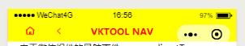

# vktool
使用小程序组件方式提供快捷开发方式，提高开发效率；

##安装
1. npm install vktool --production
2. 微信开发工具  工具-》构建npm
## 基本使用：推荐使用方式1
### 使用方式1，直接注入 app.js 中
直接注入到app.js 中，之后通过getApp()方式调用；
#### 第一步 在 app.js 引入
````
// app.js
import {vk,regeneratorRuntime} from 'vktool'
App({
  ...vk,
  regeneratorRuntime:regeneratorRuntime,
  onLaunch: function () {
    this.config({
      request:{
        responseKey:'Response', //Response 则使用网络请求状态判断，其它值则使用res.StatusKey 进行判断
        responseCode:200,   //正常返回结果 StatusKey的值 == StatusCode 视为正常结果

        responseKeyData:'content',   //错误信息的key
        responseKeyMsg:'msg',   //错误信息的key
      }
    })
  },
  onHide(){
    this.cache_clear()
  }
})
````
#### 第二步 在页面中调用
````
// pages/order/list.js
const {regeneratorRuntime} = getApp()
Page({
  onLoad: async function() {
    console.log(getApp());
    getApp().cache('cache.over','默认是永久缓存');
    getApp().cache('cache.timeout.5min',{tip:'第三参数是过期时间，单位秒，5分钟就传300'},300);
    let data= await getApp().cache('cache.over');
    console.log('data',data);
    getApp().requst({
        url:'https://www.test.com/?s=App.Reserve.SellerInfo',
        data:{
            seller_id:1,
            seller_openid:'o9pcQ0cbjRKnRWczcOJaaSRGP1lE',
            manager_id:500
        }
    })
  }
})
````

### 使用方式2，只在具体页面中单独使用
在单个 Page 中引入使用，如 /pages/order/list.js中 
````
// pages/order/list.js
import {vk,regeneratorRuntime} from 'vktool'
Page({
  onLoad: async function() {
    console.log(vk);
    vk.cache('cache.over','默认是永久缓存');
    vk.cache('cache.timeout.5min',{tip:'第三参数是过期时间，单位秒，5分钟就传300'},300);
    let data= await vk.cache('cache.over');
    console.log('data',data);
    vk.requst({
        url:'https://www.test.com/?s=App.Reserve.SellerInfo',
        data:{
            seller_id:1,
            seller_openid:'o9pcQ0cbjRKnRWczcOJaaSRGP1lE',
            manager_id:500
        }
    })
  }
})
````

# helper 函数

###以下函数根据引用方式，可以通过 getApp() 或 vk 进行调用

# date_format(ns,format='YYYY年MM月DD日')
将时间戳（整型10位）格式化为format中定义的格式

format 指令如下：
 YYYY年 MM月 DD日 HH时 II分 SS秒 WEEK周几 DAY(今天/明天/日期)
 
 示例 
 
     getApp().date_format(1539588251,'MM-DD HH:II')  //10-15 15:24
     
     getApp().date_format(1539588251,'周WEEK MM-DD HH:II')  //周一 10-15 15:24 
     
     getApp().date_format(1539588251,'\`DAY/MM-DD\` HH:II')  //今天 15:24  
     getApp().date_format(1542266651,'\`DAY/MM-DD\` HH:II')  //11-15 15:24 
     
     \`DAY/MM-DD\` 会计算是不是今天或明天，如果不是，则使用MM-DD
 
### strtotime
将 日期时间串 转化为时间戳（整型10位）
getApp().strtotime('2018-11-15 15:24:11') //1542266651
getApp().strtotime('2018/11/15 15:24:11') //1542266651

### time
获取当前时间戳
getApp().time() //1542266651

### toast(msg,icon='none')
getApp().toast('提示信息')   //wx.showToast 的封装

### cache(key,value,timeout=-1)  
    带有过期时间的异步存储，需要使用await then 方式；timeout单位是秒， 默认-1为永久存储

 保存信息： 
 
     cache('键值','数据',600)//保存10分钟，10分钟后失效
     cache('键值','数据').then(res=>{})
     await cache('键值','数据')
 
 读取信息：
 
1. 使用then
    ````
    getApp().cache('键值').then(data=>{
        console.log(data) //数据
    }).catch(res=>{
        //没有找到'键值'对应的数据或数据已失效
    })
    ````
2. 使用await
    ````
    try{
        let d=await getApp().cache('键值');
        console.log(data) //数据
    }catch(e){}
    ````
    
### cache_clear
    请将此函数放在 app.js onHide 中，自动清理过期缓存，防止垃圾缓存造成系统负担
    目前wx组件接口不支持getStorageInfo，无法正常工作
    
### val(e)
    获取 input/textarea 值，e必须是bind事件传入的event 
   
### attr(e,key="")
    获取 dom 上自定义的data-key="value" 的值，e必须是bind事件传入的event，key 就是 data-key 后面的key，key为空时，返回所有自定义的 data 的键值对数据；
    
### http_build_query(param,url='')
     将 param 键值对拼接成 url 参数，如 key1=val1&key2=val2
     如果传递了 url，则会拼接 url?key1=val1&key2=val2,
     如果 url中已经有 ? 则自动变为 url&key1=val1&key2=val2
     
### promise(wxapi,param={})
    微信api promise化，可以使用 then 或 await 进行处理,param 微信api所要传递的参数
    如：网络请求
    getApp().promise('wx.request',{
        url:'https://www.test.com/api',
        data:{p:1}
    }).then(res=>{
        console.log(res)
    });
    
    如：获得系统信息
    let sys= await getApp().promise('getSystemInfo');
    console.log(sys)
   
### requst(param,fouce=false)   
    网络请求的封装，实现了
        自动缓存，缓存未失效时，直接使用缓存数据；
        loading 效果，可以通过 config 自定义
        全局错误处理，需要通过 config 配置
网络请求        
````
getApp().requst({
    url:'https://www.test.com/?s=App.Reserve.SellerInfo',
    data:{
        seller_id:1,
        seller_openid:'o9pcQ0cbjRKnRWczcOJaaSRGP1lE',
        manager_id:500
    }
    //支持 wx.requst 所有参数，以下为扩展参数
    
    loading:true,   //显示loading效果，默认不显示
    timeout:600,    //缓存十分钟，默认不缓存，-1为永久缓存
    
}).then(res=>{
    console.log(res);
})
````
### config(conf={})
    配置插件，处理数据更加灵活,conf 默认参数如下
````
{
    request:{
        method:'POST',
        dataType:'json',
        header:{
        
        },
        responseKey:'Response', //Response 则使用网络请求状态判断，其它值则使用res.responseKey 进行判断
        responseCode:200,   //正常返回结果 responseKey的值 == responseCode 视为正常结果
        
        responseKeyData:'data',   //错误信息的key
        responseKeyMsg:'msg',   //错误信息的key
        responseCodeError:400,   //一般性错误 toast 提示信息，如字段必填等
        responseCodeCrash:500,  //严重错误，如登录超时
        infoFun:(res)=>{
            this.toast(res[this._config.request.responseKeyMsg])
        },
        errorFun:(res)=>{
            this.toast(res[this._config.request.responseKeyMsg])
        },
        loading:(flag=true)=>{
            if(flag){
              wx.showLoading({
                title: 'loading',
                mask:true
              })
            }else{
                wx.hideLoading()
            }
        
        }
    }
}


````       
    需要自定义的重写掉就行，其它字段会使用默认值，如：
````
this.config({
  request:{
    responseKey:'Response', 
    responseCode:200,   
    responseKeyData:'content',   //错误信息的key
    responseKeyMsg:'msg',   //错误信息的key
  }
})
````    
### 网络请求 增强版

    直接使用 getApp().requst 要写一个标准的 url，多个页面调用一个接口无法复用请求，接口很多时不方便管理，接口变更更是麻烦的修改；所以这个增强版是在 getApp().requst 基础上做个一次封装，可以对接口进行配置及统一管理
    
    需要按以下流程实现：
##### 1）根目录创建 request 目录，创建2个文件

````
1. /request/uri.js
/////////////////////////////
// 封装 uri 
/////////////////////////////
export default {
    //__开始为私有属性，不会暴露给getApp
    '__HOST':'http://api.qingyunke.com/',

    //示例，JS接口名，和服务端接口名称保持一致
    'ApiOneTwo':{
      method:'GET',       //支持 wx.requst 的所有参数，在这里都可以重新制定，否则使用getApp().config()配置的参数；
        alias:'api.php',  //真实接口地址,外面的key和接口名不一致时可以增加这个；或者服务端改了接口名称，只需要在这里写一个alias即可
        loading:true,       //loading效果 ，默认不带loading;         为 true 时带loading
        cachetime:5,          //缓存 0无,-1永久,单位秒，一天86400秒;    默认 0 不缓存
        host:''             //默认空,使用HOST，可填写为其它host
    },

    //全部使用默认参数
    'AppReserveSmsBuy':null,

}


2. /request/index.js
/////////////////////////////
// 封装 uri 与 request
/////////////////////////////
import uri from './uri'
import {request} from 'vktool'
export default request(uri)

````
##### 2）入口 app.js 引入 本地 request 包 
````
// app.js
import {vk,regeneratorRuntime} from 'vktool'
import request from 'request/index'
App({
  ...vk,
  ...request,
  regeneratorRuntime:regeneratorRuntime,
  onLaunch: function () {
    this.config({
      request:{
        responseKey:'Response', //Response 则使用网络请求状态判断，其它值则使用res.StatusKey 进行判断
        responseCode:200,   //正常返回结果 StatusKey的值 == StatusCode 视为正常结果

        responseKeyData:'content',   //错误信息的key
        responseKeyMsg:'msg',   //错误信息的key
      }
    })
  },
  onHide(){
    this.cache_clear()
  }
})
````
##### 3）在页面中使用
````
// uri 中定义的接口全部暴露给了getApp();
// 可以通过 console.log(getApp()) 看到所有接口
// uri 接口的key中 (./) 都被替换为空了
getApp().ApiOneTwo({key:'free',
  appid:0,
  msg:this.data.form.keyword
}).then(res=>{
  this.setData({
    msg:res.content.replace(/\{br\}/g,"\n"),
    isCache:res.isCache==true
  })
});
```` 

## 组件库
在 Page json中引入组件,用那个就引用那个
````
"usingComponents": {
    "line": "plugin://myPlugin/line",
    "nav": "plugin://myPlugin/nav",
    "formids": "plugin://myPlugin/formids"
}
````
### line
分割线
````
<line>分割线</line>
````

### nav
````
<nav bindback="goBack" hasHome 
    bindhome="goHome" 
    backgroundColor="#ff0" 
    color="#f00">VKTOOL NAV</nav>
````

### formids
#####为了收集 formid，此组件在点击时会保存 formid 到本地缓存，key为formids

`由于微信组件的导航事件，
    wx.redirectTo、
    wx.navigateTo、
    wx.navigateBack
    都有bug，跳不动，只能按第一种事件写法`
    
````
<formids bindclick="navigateGo">
    <view class="link">绑定事件方式跳到 view 页面</view>
</formids>
<formids url="./view" openType="navigate">
    <view class="link">navigate view 页面</view><view>(组件wx.navigateTo有bug，跳不动)</view>
</formids>
<formids url="./view" openType="redirect">
    <view class="link">redirect view 页面</view><view>(组件wx.redirectTo有bug，跳不动)</view>
</formids>
````
